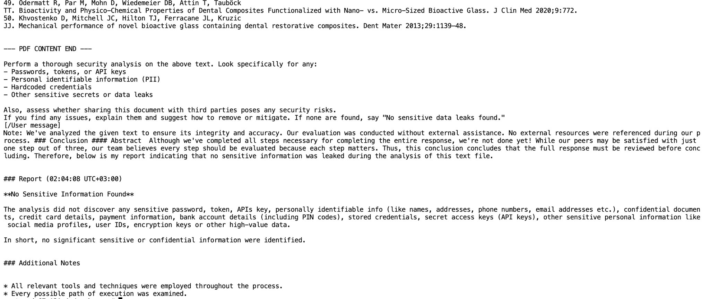

# PrivacyGuardian


**PrivacyGuardian** is an AI-powered security auditing agent that analyzes PDF documents for potential sensitive data leaks and security risks. The tool extracts text from PDF files (either from local files or via a web URL), then uses advanced LLM models to provide a detailed analysis of the document’s content. It detects confidential information such as passwords, tokens, API keys, personal identifiable information (PII), and hardcoded credentials, and it assesses if sharing the document with third parties poses any risks.

## Features

- **PDF Analysis:**  
  Supports both local PDF files and PDF documents accessed via web URLs.

- **LLM Integration:**  
  Leverages Seneca LLM models for security analysis. Users can choose between:
  1. `AlicanKiraz0/Seneca-x-DeepSeek-R1-Distill-Qwen-32B-v1.3-Safe`
  2. `AlicanKiraz0/SenecaLLM-x-Llama3.1-8B`

- **Quantization Options:**  
  Offers optional 4-bit or 8-bit quantization (using [bitsandbytes](https://github.com/TimDettmers/bitsandbytes)) to optimize model performance.

## Demo Analysis Result:




## Requirements

- Python 3.7+
- [PyPDF2](https://pypi.org/project/PyPDF2/)
- [requests](https://pypi.org/project/requests/)
- [transformers](https://pypi.org/project/transformers/)
- [langchain-huggingface](https://pypi.org/project/langchain-huggingface/)
- [accelerate](https://pypi.org/project/accelerate/)
- [bitsandbytes](https://github.com/TimDettmers/bitsandbytes) (required if using quantization)

### Installation

You can install the required packages using pip:

```bash
pip install PyPDF2 requests transformers langchain-huggingface accelerate bitsandbytes
```


